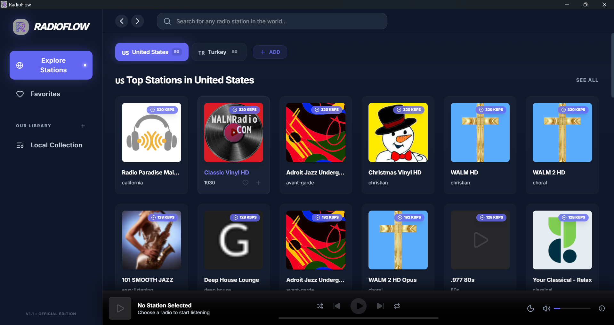

# RadioFlow

I couldn't find a properly functioning open-source radio player project on GitHub. That's why I developed this project. Fully open-source, built with Electron, React, and TypeScript.



### What's the deal?

I hate shitty low-bitrate streams. This thing focuses on high-quality audio and a simple UI that doesn't look like it's from 1995.

- **High Quality Only**: Filters streams to give you at least 128kbps. No more potato quality audio.
- **Pick Your Country**: Search by country because sometimes you want to hear what's happening on the other side of the world (or just your hometown).
- **Favorites List**: Save the stations you actually like so you don't have to find them again.
- **Always Fresh**: It pulls data from the [Radio Browser API](https://www.radio-browser.info/) every time you open it. This thing is completely open and free. If there's a new station, you get it. If a link is dead, it's gone.
- **Completely Open**: Written with Javascript and Electron. It's not "enterprise-grade" code, but it works and it's open source. 

### How to Install

#### For Normal People (The "I just want to listen" way)
1. Go to the **Releases** section on the right.
2. Download the `RadioFlow Setup 1.0.0.exe`.
3. Run it, install it, listen to it. Standard Windows stuff.

#### For Nerds (The "I want to see the mess" way)
1. Clone this junk:
```bash
git clone https://github.com/username/radioflow.git
```
2. Install the heavy node_modules:
```bash
npm install
```
3. Run it and hope for the best:
```bash
npm run dev
```

### License
GNU GPL v3.0.
